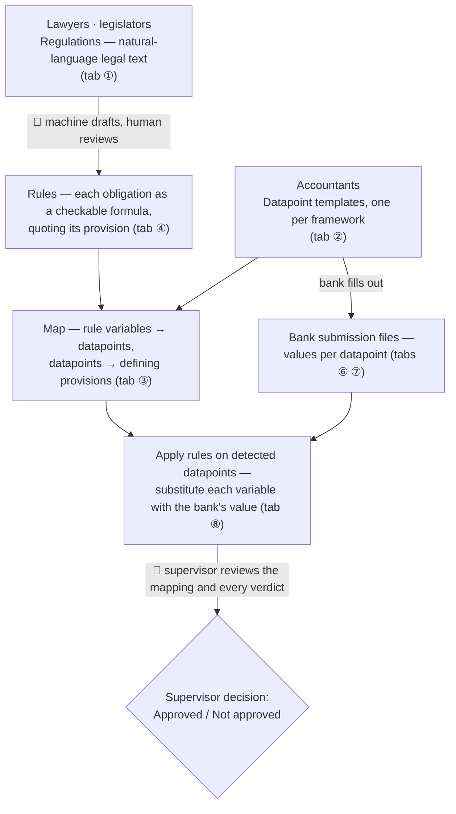

# reg-datapoint-mapper — machine-readable regulations, end to end

A working proof of concept for the pilot: from the **regulation text** to a **supervisor's
decision** on a bank's return, with every step machine-readable and every consequential
step approved by a human.

It is a **standalone consumer** of the [`regulation-parser`](https://github.com/vanessasml/eba-regulations-parser)
package: the parser is pulled from GitHub as a dependency (see `pyproject.toml`) and called
in one place — `ingest.py` — to turn regulation PDFs into citation-anchored JSON. The rest
of the app never imports the parser; it works off that JSON. Swapping the parser version is
a dependency bump, nothing else.

<p align="center">
  
</p>

## The approach

One regulation is currently re-interpreted by hand three times: authorities derive
validation rules from the text, every bank re-encodes its own reading of the reporting
templates, and supervisors reconcile the results. This pilot makes that chain
machine-readable. The schema below is the app's Home page and the team's shared mental
model — 🙂 marks a **human in the loop**:



Two principles carry the whole design:

- **Probabilistic components only draft or triage.** The LLM proposes rules and the
  matcher proposes mappings; both land as *pending* and nothing touches a bank return
  until a human approves it. The engine that applies approved rules is deterministic —
  same input, same verdict, and every check cites the provision behind it.
- **The final decision is the supervisor's.** The engine produces evidence
  (pass / fail / attention, with substituted values and citations); approving or
  rejecting the return itself is a human act, recorded and exportable.

## The app

<table>
  <tr>
    <td width="50%" align="center">
      <b>Tab ①</b><br/>
      
    </td>
    <td width="50%" align="center">
      <b>Tab ④</b><br/>
      
    </td>
  </tr>
  <tr>
    <td colspan="2" align="center">
      <b>Verdict: Approved / Not approved</b><br/>
      
    </td>
  </tr>
</table>

**Home** — the problem statement and the schema above, rendered as components.

**Workflow** — eight tabs, grouped to read as a flow **inputs → engine → what it unlocks**:

| Group | Tab | What it shows |
|---|---|---|
| Inputs | ① Regulations | Browse ingested regulations; every paragraph with citation label, breadcrumb, page. |
| Inputs | ② Datapoints | The DPM-style datapoint document: metric, dimensions→members, template coordinate, framework filter. |
| Engine | ③ Regulation → Datapoint mapping | For each datapoint, the provisions that define it (confidence + quoted text); reviewer confirms / corrects / rejects. Exports decisions. |
| Engine | ④ Rules | Machine-extracted rules pending approval: formula, variable→datapoint bindings, severity, confidence, quoted source provision. Machine gates (parse, binding, duplicates) block approval of malformed drafts. |
| Unlocks | ⑤ Supervisor register | Coverage KPIs, forward and reverse (impact-analysis) indices, CSV export. |
| Unlocks | ⑥ Bank returns | Submitted returns traced value → datapoint → provision. |
| Unlocks | ⑦ Banks overview | Datapoints × banks matrix — comparability, still anchored to the law. |
| Unlocks | ⑧ Verdicts | Approved rules applied to each return: pass / fail / attention with substituted values and citations; the supervisor approves or rejects the return and exports the decisions. |

## Setup

Requires Python ≥ 3.12 (the parser package does). Install the dependency — the parser —
from GitHub:

```bash
# with uv (reads pyproject.toml, installs the parser from GitHub)
uv sync

# or with pip
pip install "regulation-parser @ git+https://github.com/vanessasml/eba-regulations-parser.git"
```

Only `ingest.py` needs the parser, and only `extract_rules.py --live` needs the
`anthropic` SDK. Everything else — matcher, rules engine, app build — is pure standard
library.

## Run the pipeline

```bash
# 1. Ingest PDFs → data/regulations/*.json   (calls the parser package)
python ingest.py pdfs                    # or set REG_PDF_DIR; defaults to ../eba-regulations-parser/examples/pdfs

# 2. Match datapoints → provisions
python match.py                          # -> matches.json

# 3. (optional) regenerate the sample datapoints file
python gen_datapoints_file.py            # -> example_datapoints.csv / .json

# 4. Extract machine-readable rules → rules.json
python extract_rules.py                  # starter rulebook (no dependencies)
python extract_rules.py --live           # real LLM extraction: needs regulation JSONs,
                                         #   `pip install anthropic`, and credentials
                                         #   (ANTHROPIC_API_KEY or `ant auth login`)

# 5. Apply rules from the terminal (optional check)
python rules_engine.py --all             # verdicts per bank, with cited provisions

# 6. Build the app
python build_ui.py                       # -> review.html (Home + 8-tab Workflow)
```

Then open `review.html` in any browser.

## Run the UI app (React dev server)

The React app in `ui-app/` reads a single `payload.json` at the repo root — the packed
bundle of every dataset the tabs display (matches, **regulations**, datapoints, banks,
rules). `build_ui.py` writes it. The dev server serves it live from
`/artifacts/payload.json`, so once it exists a browser refresh is enough to see changes.

```bash
python build_ui.py       # (re)generate payload.json at the repo root
cd ui-app
npm install              # first time only
npm run dev              # Vite dev server → http://localhost:5173
```

**If regulations (or any other data) don't show up in the Inputs tabs, `payload.json` is
stale — regenerate it.** The regulation JSONs live in `data/regulations/` (git-ignored,
produced by `ingest.py`), but the app never reads that folder directly; it only reads the
baked `payload.json`. So the corpus appears in the UI **only after** `build_ui.py` folds
it in. Any time you re-ingest, re-run `build_ui.py` and refresh the browser:

```bash
python ingest.py pdfs    # data/regulations/*.json
python build_ui.py       # -> payload.json  ("... N regulations")   <-- do not skip
```

`npm run build` produces a self-contained bundle in `ui-app/dist/`; `build_ui.py` then
inlines `payload.json` into it to emit the standalone `review.html`.

## Data contracts

**Rules** (`rules.json`) — the rulebook is data; the engine never changes when rules do.
One comparator per expression; every variable bound to a datapoint; percentages stay in
percent units (15% → `15`), matching the returns. All extracted rules start `"pending"`.

```json
{
  "id": "R-001",
  "name": "IRRBB supervisory outlier test — early-warning threshold",
  "expr": "sot_decline_vs_tier1 <= 15",
  "severity": "warning",
  "confidence": 0.95,
  "bindings": { "sot_decline_vs_tier1": "J 07.00 r0020 c0010" },
  "source": { "doc": "EBA_GL_2018_02", "label": "Paragraph 19", "page": 8,
              "quote": "… If the decline in economic value is greater than 15% of Tier 1, the institution should inform the competent authority.",
              "via": "inherited from datapoint mapping (top candidate)" },
  "status": "pending",
  "origin": "starter"
}
```

Starter rules inherit their legal source from the mapping engine's top candidate for the
datapoint they bind — the Map is the bridge between the rule side and the provision side.

**Bank returns** (`bank_returns/*.csv`) — `entity_name, entity_lei, reference_date,
datapoint_id, value, unit`. Units: `EUR`, `%` (values in percent), `Y/N` (Yes/No → 1/0),
`count`.

## Files

| File | Purpose |
|------|---------|
| `pyproject.toml` | Declares the `regulation-parser` GitHub dependency. |
| `ingest.py` | **Integration boundary** — calls `regparser.parse_pdf` to produce `data/regulations/*.json`. |
| `match.py` | Datapoints + TF-IDF matcher over the ingested regulation JSON. Edit `DATAPOINTS` to add your own. |
| `extract_rules.py` | Rules from regulation text: `--live` LLM extraction with machine gates (parse / bindings / duplicates), default hand-curated starter set. → `rules.json` |
| `rules_engine.py` | Deterministic engine: applies rules to bank returns; CLI for terminal verdicts. |
| `gen_datapoints_file.py` | Emits the sample `example_datapoints.csv / .json`. |
| `bank_returns/*.csv` | Two example filled bank returns (the value side). |
| `data/regulations/` | Ingested regulation JSON (git-ignored; regenerate with `ingest.py`). |
| `ui/template.html` | The app's HTML/CSS/JS — edit the UI here. |
| `build_ui.py` | Thin packer: injects the JSON artifacts into the template. → `review.html` |
| `review.html` | The self-contained two-page app. |

## How this maps to production

This prototype deliberately keeps the hard parts honest. The datapoints are an
illustrative sample — in production they come from the **EBA DPM dictionary**. The
matcher is lexical only; a production version adds an **LLM re-ranker** on the shortlist
for semantic precision (this would sharpen both the mapping tab and the rule citations it
feeds, since rules inherit their sources through the Map). The starter rulebook is
hand-curated; `--live` extraction runs the real model but its output is still gated and
reviewed. What is already real and reusable: the extracted, citation-anchored regulation
text, the candidate-plus-evidence structure, the confidence banding, the deterministic
rules engine, and the human-in-the-loop review + export workflow at both review points —
the rules a bank is checked against, and the decision on the bank itself. Every proposed
link and every verdict carries the quoted source provision, so nothing is a black box.
